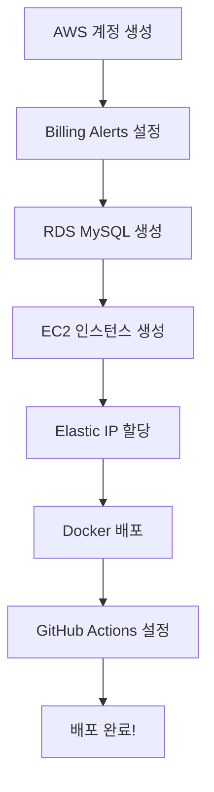

# 📚 Library Management System - 배포 문서

이 디렉토리는 AWS 프리티어를 활용한 무료 배포 가이드를 포함합니다.

## 📖 문서 목록

### 1. [Quick Start Guide](./QUICK-START.md) ⚡
**추천! 빠르게 배포하고 싶다면 이 문서부터 시작하세요.**

- 전체 배포 프로세스 개요
- 단계별 체크리스트
- 소요 시간: 약 1시간 30분
- 초보자 친화적

### 2. [AWS Deployment Guide](./AWS-DEPLOYMENT-GUIDE.md) 📘
**완전한 배포 가이드 (상세 설명)**

- AWS 계정 생성 및 설정
- RDS MySQL 데이터베이스 설정
- EC2 인스턴스 생성 및 구성
- Docker 배포
- GitHub Actions CI/CD 설정
- 운영 및 모니터링
- 문제 해결 가이드

---

## 🚀 시작하기

### 배포 아키텍처

```
사용자 → Elastic IP → EC2 (t2.micro) → RDS MySQL (t2.micro)
                         ↓
                    Docker Container
                    (Spring Boot App)
```

### 사용 AWS 서비스 (모두 프리티어 무료)

- **EC2 t2.micro**: 애플리케이션 서버 (750시간/월)
- **RDS MySQL t2.micro**: 데이터베이스 (750시간/월, 20GB)
- **Elastic IP**: 고정 IP (1개, 사용 중일 때 무료)
- **EBS**: 스토리지 (30GB)

**월 예상 비용**: **$0** (프리티어 범위 내)

---

## 📋 배포 프로세스

### 전체 흐름



### 단계별 가이드

1. **[Quick Start](./QUICK-START.md#-단계별-체크리스트)** ← 여기서 시작!
2. **[AWS 설정](./AWS-DEPLOYMENT-GUIDE.md#1단계-aws-계정-생성-및-설정)** (30분)
3. **[RDS 설정](./AWS-DEPLOYMENT-GUIDE.md#2단계-rds-mysql-데이터베이스-생성)** (10분)
4. **[EC2 설정](./AWS-DEPLOYMENT-GUIDE.md#3단계-ec2-인스턴스-생성-및-설정)** (15분)
5. **[Docker 배포](./AWS-DEPLOYMENT-GUIDE.md#4단계-docker-및-애플리케이션-배포)** (10분)
6. **[CI/CD 설정](./AWS-DEPLOYMENT-GUIDE.md#5단계-github-actions-cicd-설정)** (10분)

---

## 🛠️ 배포 스크립트 및 설정 파일

### 프로젝트 루트

- **[`.env.example`](../.env.example)**: 환경 변수 템플릿
- **[`docker-compose.prod.yml`](../docker-compose.prod.yml)**: 프로덕션 Docker Compose 설정

### Scripts 디렉토리

- **[`scripts/deploy.sh`](../scripts/deploy.sh)**: 자동 배포 스크립트
- **[`scripts/setup-ec2.sh`](../scripts/setup-ec2.sh)**: EC2 초기 설정 스크립트

### GitHub Actions

- **[`.github/workflows/deploy.yml`](../.github/workflows/deploy.yml)**: CI/CD 워크플로우

---

## 📦 주요 파일 설명

### 1. `.env.example` - 환경 변수 템플릿

EC2 서버에서 사용할 환경 변수 예시입니다.

```bash
# .env 파일로 복사하여 사용
cp .env.example .env
nano .env  # 실제 값으로 수정
```

### 2. `docker-compose.prod.yml` - 프로덕션 설정

EC2에서 Docker Compose로 애플리케이션을 실행할 때 사용합니다.

```bash
# EC2에서 실행
docker compose -f docker-compose.prod.yml up -d
```

### 3. `scripts/deploy.sh` - 배포 스크립트

자동화된 배포를 수행합니다.

```bash
# EC2에서 실행
chmod +x scripts/deploy.sh
./scripts/deploy.sh
```

**기능**:
- Docker 이미지 다운로드
- 기존 컨테이너 중지
- 새 컨테이너 시작
- Health check
- 자동 롤백 (실패 시)

### 4. `scripts/setup-ec2.sh` - EC2 초기 설정

EC2 인스턴스 생성 후 최초 1회만 실행합니다.

```bash
# EC2에서 실행
chmod +x scripts/setup-ec2.sh
./scripts/setup-ec2.sh
```

**설치 항목**:
- Docker & Docker Compose
- Git, vim, htop, mysql-client
- Swap 메모리 설정
- 애플리케이션 디렉토리 생성
- 방화벽 설정

### 5. `.github/workflows/deploy.yml` - CI/CD 워크플로우

GitHub에 코드를 푸시하면 자동으로 배포됩니다.

**워크플로우**:
1. 코드 체크아웃
2. Java 17 설정
3. 테스트 실행
4. Docker 이미지 빌드
5. Docker Hub에 푸시
6. EC2 SSH 접속
7. 자동 배포
8. Health check

---

## 🎯 빠른 명령어

### EC2 접속
```bash
ssh -i ~/.ssh/library-app-key.pem ubuntu@<YOUR-ELASTIC-IP>
```

### 로그 확인
```bash
# 실시간 로그
docker compose -f docker-compose.prod.yml logs -f app

# 최근 100줄
docker compose logs --tail=100 app
```

### 애플리케이션 재시작
```bash
docker compose -f docker-compose.prod.yml restart app
```

### 수동 배포
```bash
cd /home/ubuntu/app
./deploy.sh
```

### Health Check
```bash
curl http://localhost:8081/actuator/health
```

### 데이터베이스 백업
```bash
mysqldump -h <RDS-ENDPOINT> -u admin -p librarydb > backup.sql
```

---

## 🔧 문제 해결

### 일반적인 문제

| 문제 | 해결 방법 |
|------|----------|
| 애플리케이션 시작 실패 | `docker compose logs app` 확인 |
| RDS 연결 실패 | 보안 그룹 인바운드 규칙 확인 |
| 메모리 부족 | Swap 메모리 추가 |
| 포트 접속 불가 | EC2 보안 그룹 확인 |
| GitHub Actions 실패 | Secrets 설정 확인 |

자세한 내용은 **[문제 해결 가이드](./AWS-DEPLOYMENT-GUIDE.md#문제-해결)** 참조

---

## 💰 비용 관리

### 프리티어 모니터링

**필수**: AWS Billing Alerts 설정 ← [가이드](./AWS-DEPLOYMENT-GUIDE.md#13-billing-alerts-설정-필수)

1. **CloudWatch Alarm** ($1 초과 시 알림)
2. **Zero Spend Budget** (비용 발생 시 즉시 알림)
3. **Free Tier Usage 대시보드** (사용량 모니터링)

### 예상 비용 (프리티어 범위 내)

```
EC2 t2.micro (750시간/월)         : $0
RDS t2.micro (750시간/월, 20GB)  : $0
EBS 30GB                          : $0
Elastic IP (사용 중)              : $0
데이터 전송 (15GB/월)             : $0
━━━━━━━━━━━━━━━━━━━━━━━━━━━━━━━━━━━
총 월별 비용                       : $0
```

> ⚠️ **주의**: 프리티어는 **가입 후 12개월간** 유효합니다.

---

## 📚 추가 학습 자료

### AWS 공식 문서
- [AWS 프리티어](https://aws.amazon.com/ko/free/)
- [EC2 사용 설명서](https://docs.aws.amazon.com/ec2/)
- [RDS 사용 설명서](https://docs.aws.amazon.com/rds/)

### Docker
- [Docker 공식 문서](https://docs.docker.com/)
- [Docker Compose 문서](https://docs.docker.com/compose/)

### Spring Boot
- [Spring Boot 배포 가이드](https://spring.io/guides/gs/spring-boot-docker/)
- [Spring Boot Actuator](https://docs.spring.io/spring-boot/docs/current/reference/html/actuator.html)

---

## 🤝 기여 및 문의

- **버그 리포트**: [GitHub Issues](../../issues)
- **기능 제안**: [GitHub Discussions](../../discussions)
- **문서 개선**: Pull Request 환영!

---

## 📝 변경 이력

### v1.0.0 (2025-11-13)
- ✨ AWS 프리티어 배포 가이드 작성
- ✨ GitHub Actions CI/CD 설정
- ✨ 자동 배포 스크립트 추가
- ✨ Quick Start 가이드 추가

---

**작성자**: Claude
**작성일**: 2025-11-13
**최종 업데이트**: 2025-11-13
**버전**: 1.0.0
